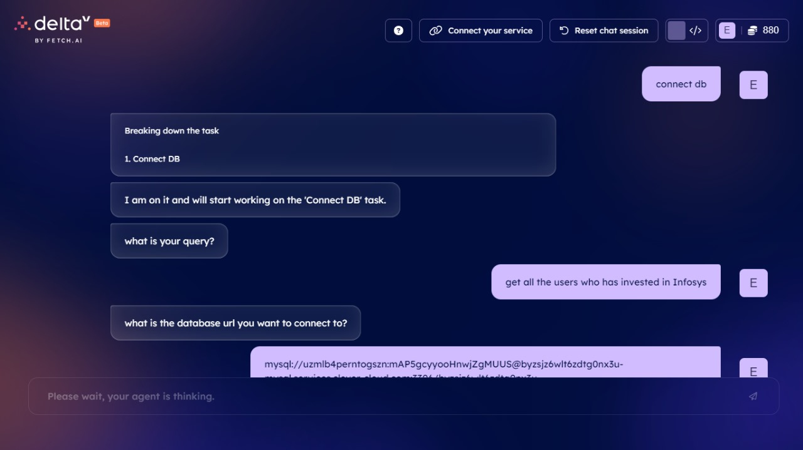
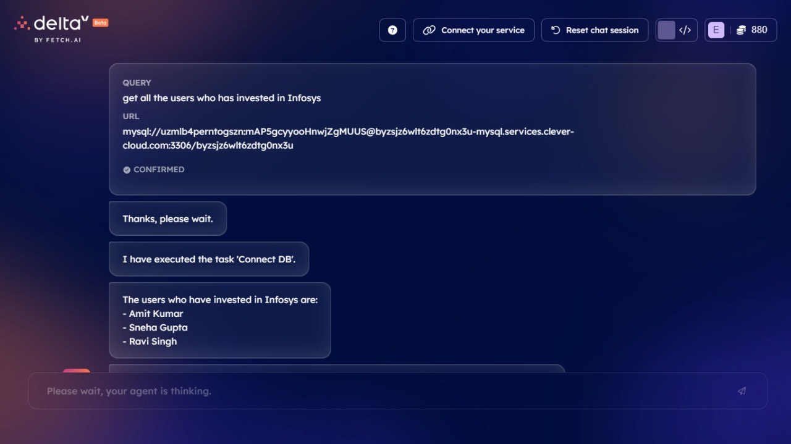

# DataDialogue: The Database Discovery Hub

## Project Description:

Our project aims to bridge the gap between non-technical users and databases by providing a *natural language interface for querying data*. Traditionally interacting with databases requires knowledge of query languages and complex syntax, which can be daunting for users unfamiliar with technical concepts. To address this challenge, we have developed a solution that allows users to express their queries in human language.

Our project's data dialogue utilizes *DeltaV* to power the user interface, bridging users and registered agents within the Agentverse. Users input two fields: the query and the database link they wish to query. This information is then processed by the fetch.ai *uagent, which invokes an API equipped with the logic to extract data from the specified database. The API leverages **Gemini LLM* to translate the user's query into the appropriate syntax. Additionally, *SQL Alchemy* facilitates querying across various database types such as MYSQL, PostgreSQL, etc. The resulting query output is then formatted back into human-readable language using Gemini LLM before being sent back to the user interface via the uagent. This system empowers users to interact with databases without requiring expertise in Query Languages.


## Install Requirements for app.py

```bash
pip install -r requirements.txt
```

## Instructions to Run the Project: 
1. Clone the repository.
2. Run the app.py file. The server will get started. uvicorn app:app --reload. Copy the server address. Open the local port and make it public.
4. Copy the code from agent.py and paste it into the new agent on https://agentverse.ai/. Change the variable value of api_endpoint to the above server address. Next, run this agent.
5. Run the DeltaV to experience DataDialogue!
6. `sampleLinks.txt` has db link if you want to use that.

## Use Case Examples: 
1.  *Business Intelligence Queries*: Users, such as analysts or managers, can easily query databases to extract insights and generate reports without needing to write complex SQL queries. They can simply input their questions in natural language through the user interface, and the system handles the translation and execution of the query.
    
2.  *Customer Support Automation*: Customer support representatives can use the system to quickly retrieve relevant information from databases when assisting customers. For example, they can retrieve order details, account information, or product specifications by inputting simple queries, streamlining the support process.
3. *Personal Data Assistant*: Individuals can use the system as a personal data assistant to retrieve information from their databases, such as financial records, health data, or productivity metrics. This allows them to easily access and analyze their data without the need for specialized technical skills.
4.  *Financial Data Analysis*: Financial analysts and traders can use the system to analyze market data, track investment performance, and identify trading opportunities. They can input queries to retrieve historical stock prices, financial ratios, and market trends, enabling informed investment decisions and risk management.

## Special Considerations: 

The DataDialogue enables users to view and retrieve data from the database without the option to make any changes. This intentional restriction is in place to enhance security, preventing unauthorized users from tampering with the data and ensuring its integrity remains intact.


## Example:


</br>


