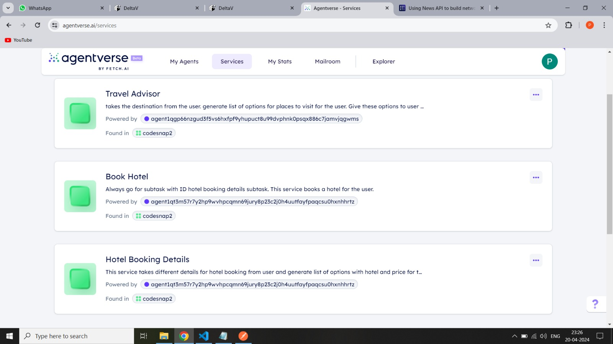

# Integrating TombaAPI with Fetch AI Agent

## Project Information

Feeling overwhelmed by the myriad of options when planning your next adventure abroad? Don't worry! Our project provides a one-stop solution for all your travel needs, offering personalized destination recommendations, flight bookings, and accommodation options. Say farewell to travel planning stress and hello to hassle-free adventures. Let's dive in and start planning your dream trip!

## TechStack Used

   - Python
   - Fetch.ai uAgent Library
   - Map Geocoding API,Tripadvisor API,Sky Scrapper API,Maps Data API

 ## Getting Started
      To get started with the Travel Advisor Agent, follow these steps:

      1. Create Agents on agentverse 

      2. Obtain your RapidAPI key:
               -Sign up or log in to your RapidAPI account.
               -Subscribe to the Maps Data API/TravelAdvisor/SkyScrapper and obtain your API key.

      3. Set up the project:
               Replace "YOUR_RAPIDAPI_KEY" in the code with your actual RapidAPI key.

      4. Run the agent: python your_agent_file.py

      5. Create Service  for Respective Agents and add them to a Service Group





      6. At DeltaV , select Service Group and start chat

## Video DEMO

Watch the video Demo [here](https://drive.google.com/file/d/1xRtWltMACHMjIhsLsiReNxpvKO6CTkIa/view?usp=drive_link).

OR

(https://drive.google.com/file/d/1xRtWltMACHMjIhsLsiReNxpvKO6CTkIa/view?usp=drive_link)

## Agents Used in our Project

** Travel Advisor Agent **

   The Travel Advisor Agent provides personalized travel recommendations for users based on their destination preferences. It leverages the RapidAPI Maps Data API to gather information about various places to visit in the specified location.


   ## Usage
      Once the agent is up and running, users can interact with it by sending a message with the name of the destination they want to visit. The agent will respond with a list of recommended places to visit in that location.

   ## Example
      Here's an example of how to interact with the Travel Advisor Agent:

         |                                                  |
         |  User: What are some places to visit in Paris?   |
         |   Agent:                                         |
         |   - Eiffel Tower                                 |
         |   - Louvre Museum                                |
         |   - Notre-Dame Cathedral                         |
         |   ...                                            |
         |                                                  |


** Hotel Booking Agent **

   The Hotel Booking Agent allows users to book hotels based on their preferences. It integrates with the TripAdvisor API to provide users with a list of available hotels in the specified location and allows them to book their desired hotel.

   ## Usage 
         1. Request Hotel Booking Details:
               Send a message to the Hotel Booking Agent with the address, check-in date, check-out date, and number of rooms.
               Example: { "address": "Paris", "checkIn": "2024-04-20", "checkOut": "2024-04-25", "rooms": 2 }
         2. Book Hotel:
               Once you receive the list of available hotels, select the desired hotel and send a message to the agent with the booking details.
               Example: { "bookquery": "Hotel Name - Price" }

   ## Example
         Here's an example of how to interact with the Hotel Booking Agent:

          |                                                                                                    |
          |  User: Please provide hotel booking details for Paris from 2024-04-20 to 2024-04-25 for 2 rooms.   |
          |  Agent:                                                                                            |
          |  - Hotel 1: Hotel Name 1 - Price 1                                                                 |
          |  - Hotel 2: Hotel Name 2 - Price 2                                                                 |
          |                                                                                                    |

** Flight Booking Agent **

   The Flight Booking Agent allows users to search and book flights based on their preferences. It integrates with the Sky-Scrapper API to provide users with a list of available flight options between specified source and destination airports on a given date.


   ## Usage
         Request Flight Offers:
            Send a message to the Flight Booking Agent with the source, destination, date of travel, and number of passengers.
            Example: { "src": "New York", "dest": "Los Angeles", "date": "2024-04-20", "person": 2 }

   ## Example
         Here's an example of how to interact with the Flight Booking Agent:

            |                                                                                                       |
            |   User: Please provide flight options from New York to Los Angeles on 2024-04-20 for 2 passengers.    |
            |   Agent:                                                                                              |
            |   - Flight 1: Delta Airlines - Price: $200                                                            |
            |   - Flight 2: United Airlines - Price: $220                                                           |
            |                                                                                                       |


Now you have the agents up and running to perform travel planning integrations using the provided APIs. Happy integrating!

## Contibutors:

```
    Piyush Dahake (https://github.com/piyush960)
    Paras Yerunkar (https://github.com/ParasY1724)
    Pratik Patil Gaikwad (https://github.com/Pratik-Patil3800)

```
