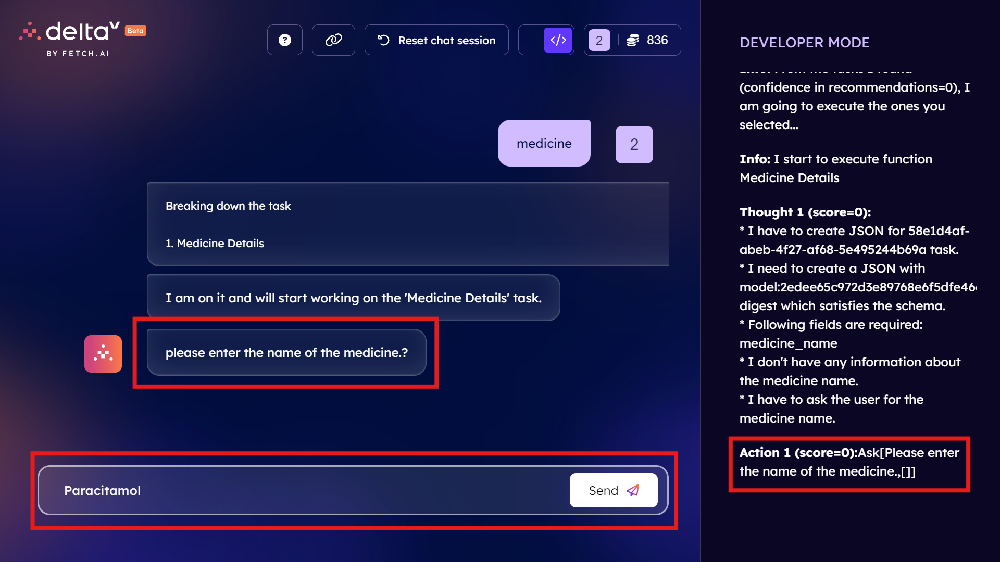

[](https://fetch.ai/)
[](https://agentverse.ai/)
[]([https://your-deltav-link.com](https://deltav.agentverse.ai/))
[](https://code.visualstudio.com/)
[](https://your-chatgpt-link.com)


# MedIQ Agent Powered By Fetch AI 


## Overview

MedIQ is a conversational agent designed to provide detailed information about various medicines. By interacting with MedIQ, users can obtain essential information regarding the usage, contraindications, dosage, side effects, storage, expiration, manufacturing details, overdose symptoms, and ingredients of specified medicines.

## Output Video
https://github.com/mdabucse/Medical-Agent-FETCH-AI-/assets/131733014/74047438-df3b-47b5-a650-c15439fd5e48
## Table of Contents
1. [Features](#features)
2. [WorkFlow](#workflow)
3. [Setup and Installation](#setup-and-installation)
4. [Code Explanation](#code-explanation)
5. [Example Interaction](#example-interaction)
6. [Support](https://fetch.ai/docs)


## Features

- **Medicine Information**: Provides comprehensive details about a specified medicine.
- **Conversational Interface**: Interacts with users through a chat-based interface.
- **Powered by OpenAI**: Utilizes OpenAI's API to generate responses based on user prompts.

## WorkFlow


## Setup and Installation

1. **Clone the Repository**:
    ```bash
    git clone https://github.com/mdabucse/Medical-Agent-FETCH-AI-.git
    cd <AI AGENT>
    ```

2. **Install Dependencies**:
    Make sure you have Python installed. Install the required packages using pip:
    ```bash
    pip install -r requirments.txt
    ```

3. **Set Environment Variables**:
    You need to set your OpenAI API key as an environment variable. You can do this in your terminal:
    ```bash
    export OPENAI_API_KEY='your_openai_api_key'
    ```

4. **Run the Agent**:
    Execute the following command to run the MedIQ agent:
    ```bash
    python Main.py
    ```

## Usage

1. **Initialize the Agent**:
    The agent is initialized with a predefined seed phrase. The address of the agent will be printed on the console.
    ```python
    SEED_PHRASE = "MED IQ"
    print(f'My Agent Address Is {Agent(seed=SEED_PHRASE).address}')
    ```

2. **Funding the Agent**:
    Ensure the agent's wallet is funded to interact with the network.
    ```python
    fund_agent_if_low(MedIQ.wallet.address())
    ```

3. **Define the Protocol**:
    A protocol named `MedIQProtocol` is defined to handle messages.
    ```python
    MedIQProtocol = Protocol("MEDIQ Protocol")
    ```

4. **Interacting with the Agent**:
    Users can send a message to the agent by specifying the medicine name. The agent processes the request and provides detailed information about the medicine.

## Code Explanation

- **Models**:
    - `Medi`: A model to capture the medicine name provided by the user.

- **Agent Initialization**:
    - The agent is initialized using a seed phrase and is associated with a unique mailbox key.

- **OpenAI Integration**:
    - The `output` function sends a prompt to OpenAI's API to fetch detailed information about the medicine.

- **Message Handling**:
    - The `load_model` function handles incoming messages, processes the prompt, fetches the response from OpenAI, and sends the information back to the user.

## Example Interaction

When a user sends a message with the medicine name, the agent responds with detailed information formatted as follows:

1. Local Agent Connected With Agentverse  
    
2. Create Functions for the Agents
    
3. Publish The Agent Into the Agentverse
    
4. Go to IDE Run the Agent
    
5. Click Test In DeltaV
    
7. Click My Functions
    
8. Interactions
    
    
    
    
    
