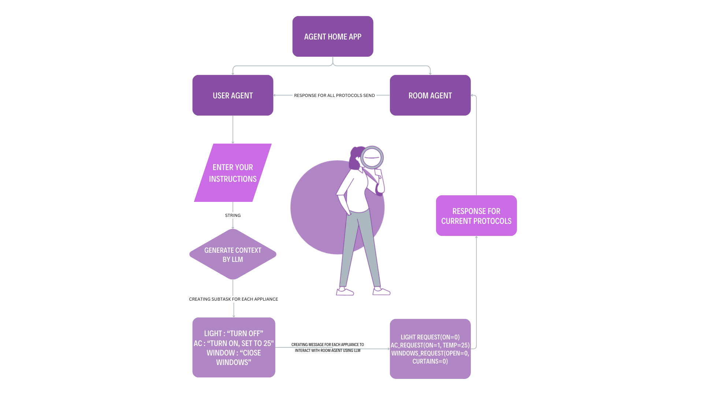

# Agent Home

<div align="center">
  
</div>

## Overview

The Smart Room Automation System is designed to simplify and streamline user interactions with room appliances such as lights, air conditioners, and windows. By integrating these appliances with a central control system, users can issue combined instructions to manage multiple devices simultaneously.

## Functionality

The system operates through a Language and Logic Module (LLM) that interprets user inputs and generates sub-tasks for each appliance based on the user's query. These instructions are then forwarded to the Room Agent, which communicates with the individual appliances through a specified protocol.

- _User Input_: Users provide combined instructions to the LLM, such as "turn off the lights, set the temperature to 25°C, and close the windows."
- _LLM Processing_: The LLM analyzes the user input and generates sub-tasks for each appliance involved. For example:
  - Lights: Turn off
  - Air Conditioner: Set temperature to 25°C
  - Windows: Close
- _Room Agent Communication_: The Room Agent receives these sub-tasks as RequestMessages from the LLM on behalf of the user.
- _Appliance Control_: Based on the received instructions, the Room Agent takes appropriate actions to control each appliance.
- _Response to User_: After completing the tasks, the Room Agent sends a ResponseMessage back to the user to confirm the actions taken.

## Workflow

<div align="center">
  
</div>

## Getting Started

1. Clone the repository:

   ```bash
   git clone https://github.com/fetchai/uAgents.git
   cd integrations
   cd agent-home
   ```

2. Install dependencies :

   ```bash
   poetry install
   ```

3. Run the application:

   ```bash
   python3 main.py
   ```

4. Access the application at terminal.

## About files

- user.py: This module defines the user agent. The agent is set up with a name, port, seed, and endpoint. It also has several event handlers defined for different types of messages (e.g., LightsResponse, ACResponse, WindowResponse). These handlers dictate how the user agent should respond when it receives these types of messages.

- room_agent.py: This module defines the room agent. Like the user agent, it is set up with a name, port, seed, and endpoint. It also includes several protocols (light_proto, ac_proto, window_proto) which define how it should handle different types of requests.

- room_protocols.py: This module defines the protocols for handling different types of requests (LightsRequest, ACRequest, WindowRequest). Each protocol has a handler function that dictates how the room agent should respond when it receives a request of that type

## Advantages

- _Convenience_: Users can issue combined instructions without needing to operate each appliance individually.
- _Efficiency_: Tasks are streamlined and executed promptly through centralized control.
- _Customization_: The system can be tailored to accommodate additional appliances or specific user preferences.

## Contributors

- [Shivam Kumar](https://github.com/shivam6862)
- [Sarvagya Porwal](https://github.com/Sar2580P)
- [Puspendra Mahariya](https://github.com/silent-cipher)

## TEAMID - 15504
