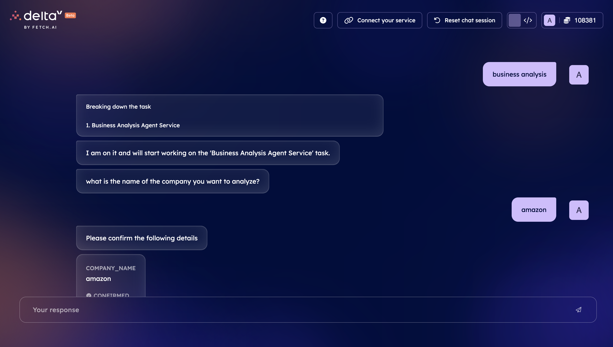
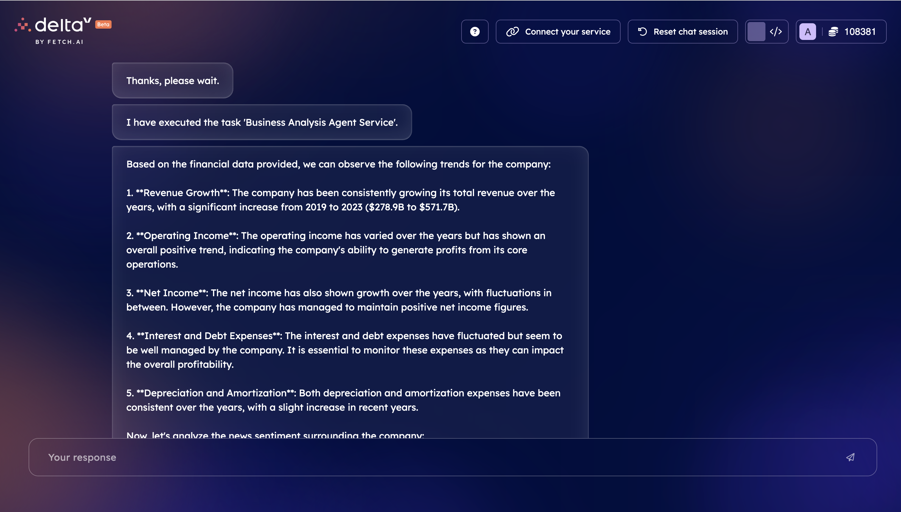
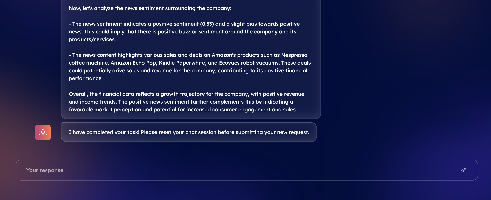

# AI powered Business Analysis Integration

## Overview

This Integration provides analysis of business using financial trends from `Aplha Vantage` and news from `Gnews`.
A prompt is created using all the information and sent to `OpenAI gpt-3.5-turbo` model to analyse the business.
DeltaV is used to query the agent with name of the company, if financial data or news data is not present, it will analyse the company on it's own knowledge and provide insights.

## Steps to use this Integration on deltaV.

- subscribe all API keys needed for the script.

    - [Open AI](https://platform.openai.com/api-keys) API key for LLM model.
    - [Alpha Vantage](https://www.alphavantage.co/support/#api-key) API key for `ticker symbol` and Financial data.
    - [GNews](https://gnews.io/) API key for getting latest news for company
    - [AgentVerse Mailbox key to make agent deltaV accessible].

- Open `terminal` on your local machine and save the script as `business_analyst.py`.
- Run the python script to get the `agent's address` and create a mailbox.
- Update all the API keys and run the script again.
- Setup `service` in [Agentvserse](https://agentverse.ai/services) as mentioned in `service.json`

- Query `Business analysis` service on [DeltaV](https://deltav.agentverse.ai/).

## Expected Output.

