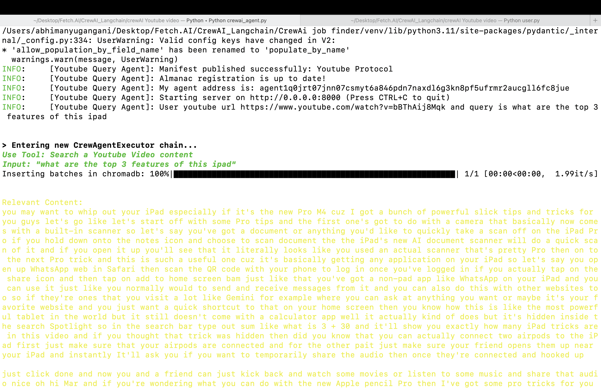
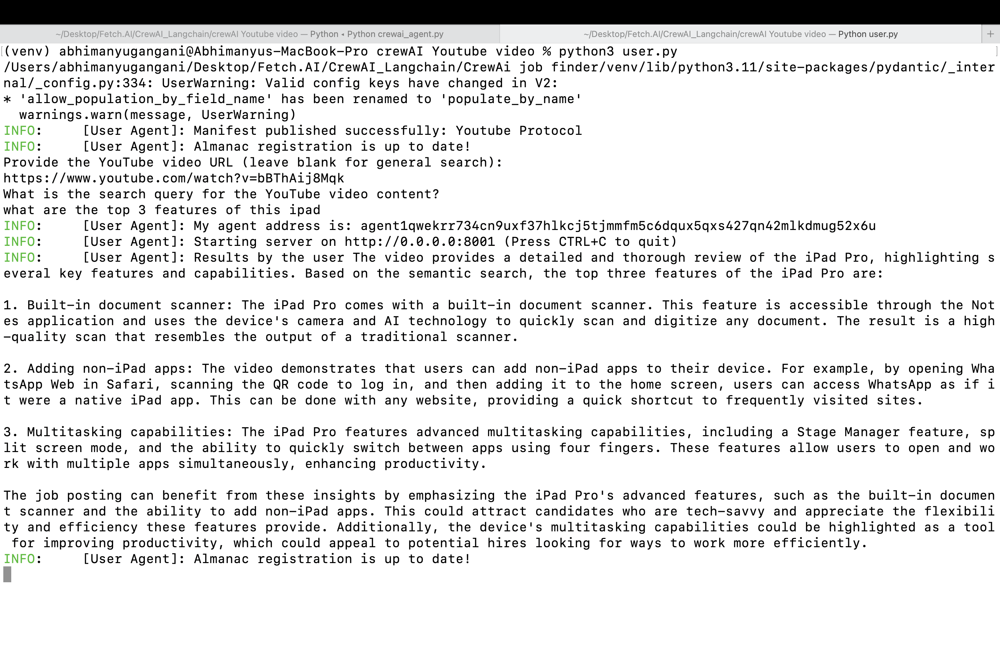

# CrewAI YouTube Query Integration with uAgents

This project demonstrates the integration of CrewAI's capabilities to analyze YouTube video content with uAgents, enabling automated video content analysis and reporting. The system uses CrewAI to perform detailed analysis of YouTube videos based on user queries and utilizes uAgents to facilitate communication between agents.

## Project Structure

    - **crewai_agent.py:** Main agent script that handles the YouTube video analysis using CrewAI.
    - **crewagents.py:** Defines the CrewAI agents used for analyzing YouTube content.
    - **user.py:** User agent script to interact with the main agent and submit YouTube video queries.
    - **tasks.py:** Defines the tasks for analyzing YouTube content.
    - **requirements.txt:** Lists the dependencies required for the project.

## Setup Instructions

### Prerequisites
    - Python 3.7 or later
    - pip (Python package installer)

## Installation

1. Clone the Repository

    ```bash
    git clone https://github.com/fetchai/uAgents.git
    cd uAgents/integrations/Crewai-youtube-integration
    ```

2. Create a virtual environment and activate it:

    ```bash
    python3 -m venv venv
    source venv/bin/activate   # On Windows: venv\Scripts\activate
    ```

3. Install the dependencies:

    ```bash
    pip install -r requirements.txt
    ```

## Running the Agents

`Before running the agent please make sure to replace your seed phrases`

**Step 1:** Run the Main Agent
This agent handles the YouTube video analysis using CrewAI.

    ```bash
    python3 crewai_agent.py
    ```

**Step 2:** Run the User Agent
This agent interacts with the main agent and submits YouTube video queries.
Once you run the main agent take the agent address from the logs and replace it in user agent's code.

    ```bash
    python3 user.py
    ```

## Interacting with the Agents

1. When you run the user.py script, it will prompt you to enter the YouTube video URL and the search query:

    ```bash
    Provide the YouTube video URL (leave blank for general search):
    https://www.youtube.com/watch?v=bBThAij8Mqk
    What is the search query for the YouTube video content?
    ```

2. The user agent sends this information to the main agent, which processes the video and returns the analysis results.

## Expected Output:


