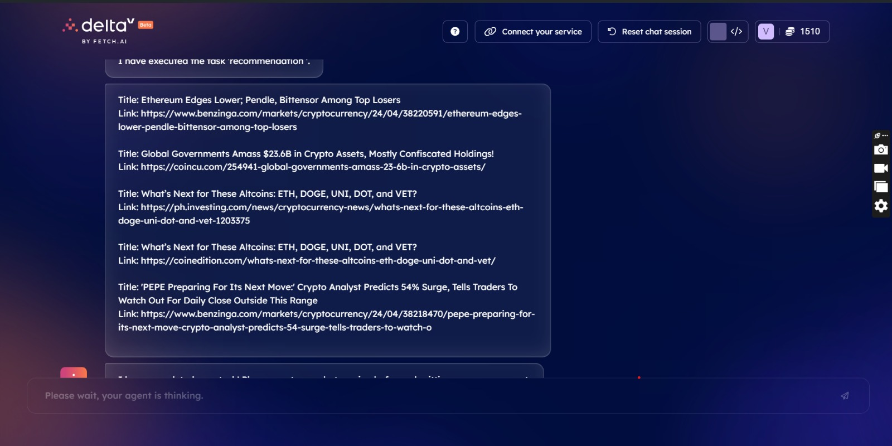
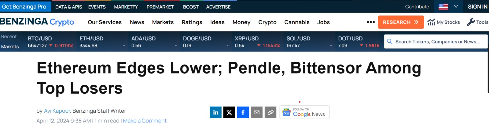

# 🪙 CoinMarketCap API Integration with uAgents Hackathon Project

## 🚀 Introduction

Welcome to our Hackathon project where we integrate the CoinMarketCap API with Fetch.ai AI Agent technology to create innovative solutions in the world of cryptocurrencies. In this project, we aim to provide real-time data on cryptocurrencies, fetch relevant news, and discover the top trending cryptocurrencies using uAgents.

## 🎯 Problem Statement

Our challenge was to integrate the CoinMarketCap API with Fetch.ai AI Agent technology to solve a problem or create something innovative and provide a business useCase of it. We aimed to go beyond simple integration and present creative use cases for this combination of technologies.

## 📊 CoinMarketCap API

The CoinMarketCap API is a Text2Text integration that provides comprehensive data on cryptocurrencies. You can learn more about it [here](https://rapidapi.com/zakutynsky/api/CoinMarketCap/).

## 📥 User Input

To use our agents, you need to enter a cryptocurrency symbol as input on DeltaV. The symbol should be a valid cryptocurrency symbol like `ETH` for Ethereum, `BTC` for Bitcoin, `XRP` for Ripple, `SOL` for Solana, etc.

Here's an example of how to enter an input:

1. Open DeltaV.
2. Select the agent you want to use (CryptoDataAgent, CryptoNewsAgent, or TrendingCryptoAgent).
3. In the input field, enter the cryptocurrency symbol. For example, if you want data on Ethereum, enter `ETH`.
4. Click on the 'Send' button.

The agent will then fetch and display the data related to the cryptocurrency symbol you entered.

## 🤖 uAgents Integration

We integrated the CoinMarketCap API with uAgents to create two agents:

1. **CryptoDataAgent**: Provides real-time data on the requested cryptocurrency.

| Name     | Symbol | Price            | Volume (24h)       | Change (24h) | Market Cap           |
|----------|--------|------------------|---------------------|--------------|----------------------|
| Bitcoin  | BTC    | 66863.51170428682| 43620642781.30312   | -4.76221334% | 1315925261517.3535   |
| Ethereum | ETH    | 3210.858383837866| 21614062100.60566   | -8.52252725% | 385530857439.1761    |

2. **CryptoNewsAgent**: Fetches relevant news articles related to the requested cryptocurrency.

3. **TrendingCryptoAgent**: Identifies the top trending cryptocurrencies globally.

## 🎥 Video Demo

[Recommendation and Crypto_data](http://www.youtube.com/watch?v=1mNh9GcWcNA)

[News and Crypto_data](https://youtu.be/XD0RHiPqi2s?si=XUVdYDZm_WVguZqO)

## 💼 BUSINESS USECASE

Our application is a powerful tool for cryptocurrency portfolio management. It caters to the needs of cryptocurrency investors by providing real-time data for their portfolio cryptocurrencies. By simply entering the symbols of their cryptocurrencies, users can access up-to-the-minute information including price, 24-hour change, and market cap, enabling them to make informed investment decisions.

In addition to personalized data, our application also offers a recommendation feature. It identifies and displays the top 10 performing cryptocurrencies, providing users with insights into potential investment opportunities in the dynamic crypto market.

Moreover, our application keeps users abreast of the latest market trends by fetching relevant news about the cryptocurrency market. This feature ensures that users are always informed about the current market scenario, further aiding in their investment strategy.

In essence, our application serves as a comprehensive, real-time cryptocurrency portfolio management tool, helping users optimize their investment decisions.