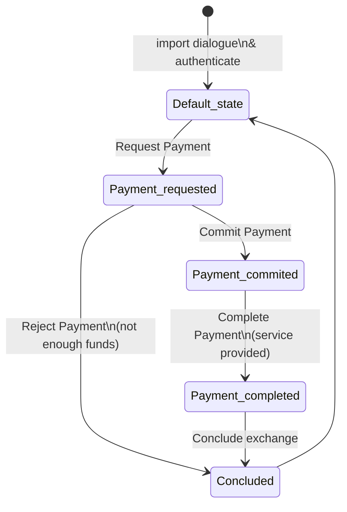

```mermaid
stateDiagram-v2
    [*] --> Default_state : import dialogue\n& authenticate
    Default_state --> Payment_requested : Request Payment
    Payment_requested --> Payment_commited : Commit Payment
    Payment_requested --> Concluded : Reject Payment\n(not enough funds)

    Payment_commited --> Payment_completed : Complete Payment\n(service provided)

    Payment_completed --> Concluded : Conclude exchange
    Concluded --> Default_state
```
