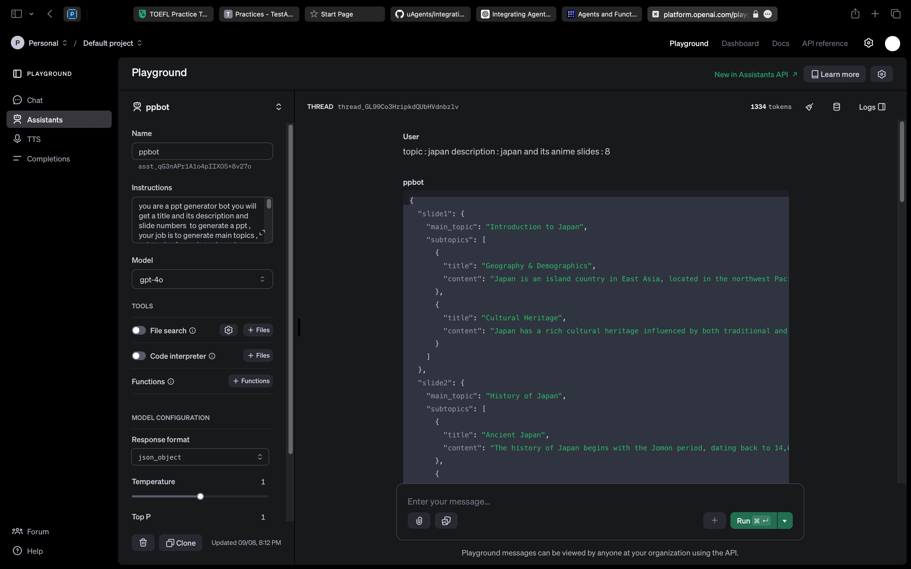
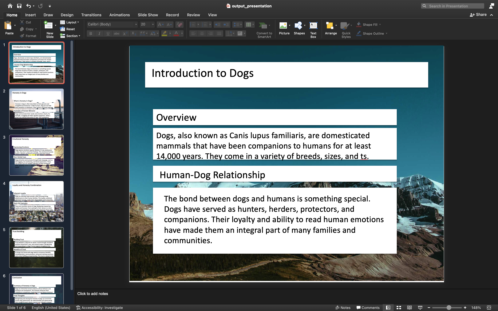

# PPT Generator Agent

This project generates a PowerPoint presentation based on user input for the title, description, and the number of slides. The project uses a Python script with a GUI for user input and integrates an OpenAI assistant to generate the content for the slides.

## Prerequisites

1. **Python 3.10**: Make sure you have Python installed on your machine.
2. **OpenAI API Key**: You'll need an API key from OpenAI to use the assistant for generating slide content.
3. **Assistant ID** : create assistant in open ai platform and use its id

## Installation

1. Clone this repository to your local machine:
   ```bash
   git clone https://github.com/your-repo/ppt-generator-bot.git
   cd ppt-generator-bot
   ```


2. Install the required Python packages:
   ```bash
   pip install -r requirements.txt
   ```

## OpenAI Assistant Setup

Before running the script, you need to create an OpenAI assistant. Use the following prompt for your assistant:



**Assistant Prompt:**

```
You are a PPT generator bot. You will receive a title, its description, and the number of slides to generate a PPT. Your job is to generate main topics, subtopics for each main topic, and content for each subtopic. 

- The number of slides can be between 8 to 12.
- Each slide should include everything related to the topic and description.
- Each slide should have a minimum of 2 and a maximum of 3 subtopics.
- The content for each subtopic should be between 80 and 150 words.

Return a JSON file in the following format:

{
    "slide1": {
        "main_topic": " ",
        "subtopics": [
            {"title": " ", "content": " "},
            {"title": " ", "content": "."},
        ]
    },
    ...
}
```

## Usage

1. **Run the Script**:
   To start the application, run the following command in your terminal:

   ```bash
   python agent.py
   ```
2. **GUI Input**:

   - A GUI window will appear, prompting you to enter the title, description, and the number of slides you want to generate.
   - Fill in the details and click "OK".
3. **Output**:

   - The script will generate a PowerPoint presentation based on the inputs and save it as `output_presentation.pptx` in the current directory.



## Example

Here’s an example of how the generated JSON might look:

```json
{
    "slide1": {
        "main_topic": "Introduction to AI",
        "subtopics": [
            {"title": "What is AI?", "content": "Artificial Intelligence (AI) refers to the simulation of human intelligence in machines..."},
            {"title": "History of AI", "content": "The concept of AI dates back to the mid-20th century, with early milestones including..."}
        ]
    },
    "slide2": {
        "main_topic": "Applications of AI",
        "subtopics": [
            {"title": "Healthcare", "content": "AI is revolutionizing healthcare by enabling precision medicine..."},
            {"title": "Finance", "content": "In finance, AI is used for algorithmic trading, fraud detection..."},
            {"title": "Manufacturing", "content": "AI-driven automation is enhancing manufacturing processes..."}
        ]
    }
    // more slides...
}
```
