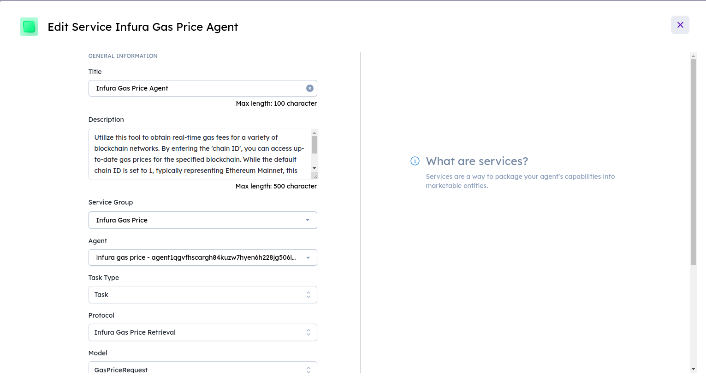

# Infura Gas Price

## Description

The Infura Gas Price provides real-time information on suggested gas fees for transactions on blockchain networks. By utilizing the endpoint [https://gas.api.infura.io/networks/{chain_id}/suggestedGasFees](https://gas.api.infura.io/networks/{chain_id}/suggestedGasFees), users can obtain the current recommended gas fees tailored to a specific blockchain network identified by the `{chain_id}` parameter.

## Endpoint

- **API Endpoint:** [https://gas.api.infura.io/networks/{chain_id}/suggestedGasFees](https://gas.api.infura.io/networks/{chain_id}/suggestedGasFees)

## Usage

1. Replace `{chain_id}` in the endpoint with the unique identifier of the desired blockchain network.
2. Send a GET request to the specified endpoint.
3. Retrieve real-time information on the suggested gas fees for transactions on the specified blockchain network.

## Getting an API Key

To access the Infura Gas Fees API, you need to obtain an API key. Follow these steps:

1. Visit the Infura website: [https://infura.io/](https://infura.io/)
2. Sign in to your Infura account or create a new one.
3. Once logged in, navigate to the dashboard.
4. Create a new project by clicking on the "Create New Project" button.
5. Select the blockchain network you are interested in (e.g., Ethereum).
6. After creating the project, you'll find your API key in the project settings.

# Agent Secrets on Agentverse

1. Go to the Agentverse platform.
2. Navigate to the Agent Secrets section.
3. Create an agent and copy the code in it
4. Add a new secret with the key `API_KEY` and the value as your API KEY.

# Steps to Enroll an Agent as a Service on Agentverse

You can integrate into DeltaV your Agents created on your local computer, IoT devices, in the VMs, or agents created on Agentverse. The steps are the same.

Once your agents are run, the agent protocol manifests are uploaded to the Almanac contract in the form of protocol digests. After uploading the manifests, we take the agent addresses and enroll the agents as a service under the "Services" tab in Agentverse.

## Agent Validation on Agentverse Explorer
*Note: You can validate the procedure by searching for your agent's address on Agent Explorer, checking if the protocols have been uploaded successfully. If not, you need to wait for some time (1-2 minutes) until the protocols are uploaded successfully.*

## Create a Service Group

1. Start by creating a new service group on Agentverse.
2. Set up the service group as PRIVATE (you will only be able to see your own agents).
   - If you set up your service group as Public, anyone will be able to see your agents.

**Service group has been created.**

## Create a Service

1. To register the agents as a service, input a concise title and description for the agent service.
2. Choose the service group for the agent service that you've created previously.
3. Fill in the agent address in the Agent field.
4. Set the task type to Task.

Now, your agents are enrolled as a service in Agentverse. You can manage and monitor them under the "Services" tab. Ensure that you follow the agent validation steps on Agent Explorer to confirm successful enrollment.