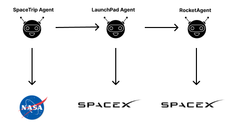

# Mars Tourism

### The Mars Tourism project aims to facilitate trip planning to Mars by utilizing NASA and SpaceX APIs. It provides users with information about available launchpads, rockets, and potential hazards such as asteroids during the planned travel dates, issuing warnings when necessary.
 

## Video Demo

You can watch a Video Demo of Our project at: [Video Link](https://drive.google.com/drive/folders/1gdjTXcfhwj98s0RVtGJTuTPOlhVEVbG6?usp=drive_link)

## Setting up 

1. **Clone Repository**: Clone the project repository and navigate to the project folder.

2. **Agent Integration**:

   - Copy the provided agents and paste them into the Agentverse Blank agent template, along with their respective booking protocol files if available.

3. **Service Group Creation**: Create a service group consisting of all three agents.

4. **Task Assignment**:

   - Assign the SpaceTrip agent as the main task.
   - Assign the rest of the agents as sub-tasks.

5. **Agent Descriptions**:

   5.1 **Space Trip Planner**:

   - Interacts with the Launchpad Selector service (to get launchpad)  Rocket Selector service (to get rocket and weight) which acts as subtasks, then it also interacts with NASA API by getting start date from the user. Finally it will make request to another API to get the payment link

   | Field      | Description                                                                                                                                   |
   | ---------- | --------------------------------------------------------------------------------------------------------------------------------------------- |
   | launchpad  | Name of the launchpad retrieved from the subtask. DO NOT ASK THIS FROM THE USER.                                                              |
   | rocket     | Name of the rocket retrieved from the subtask. DO NOT ASK THIS FROM THE USER.                                                                 |
   | start_date | Date of the day you want to go for the trip. Ask from the user using a calendar interface allowing users to enter future (format=YYYY-MM-DD). |
   | weight     | Weight of the person retrieved from the subtask. DO NOT ASK THIS FROM THE USER.                                                               |

   5.2 **Launchpad Selector**:

   - This subtask IS ONLY relevant for the objective of selecting a launchpad and it IS NOT relevant for the objective of selecting a rocket. This subtask interacts with SpaceX api to get the launchpads and allow to book them and sends the selected launchpad back to main task

   | Field | Description                                                                                                                                      |
   | ----- | ------------------------------------------------------------------------------------------------------------------------------------------------ |
   | query | DO NOT TAKE THIS INPUT FROM THE USER, DEFAULT IT TO "trip in outer space"". |

   5.3 **Rocket Selector**:

   - Interacts with SpaceX api to get the rockets and allow to book them and send the selected rocket back to main task

   | Field  | Description                                                           |
   | ------ | --------------------------------------------------------------------- |
   | weight | Total weight of the person that will help to select the right rocket. |

6. **DeltaV Integration**: Connect DeltaV to the created service for seamless interaction and task execution.

7. **User Interaction**:
   - Prompt the system with a related request such as "Book me a trip to Mars".

### Working

