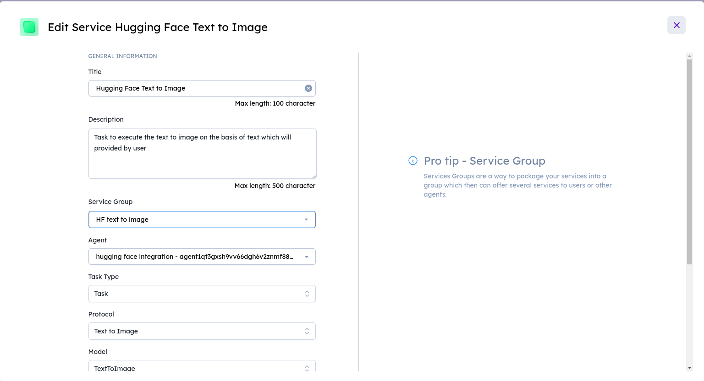

# OpenJourney V4 Hugging Face Model

## Description
The OpenJourney V4 Hugging Face model is a powerful tool designed to convert text into images, specifically focusing on generating images.

## Categories
- Text-to-Image Generation
- Hugging Face

## Usage Instructions

### Hugging Face Model
1. **API Endpoint:** [https://api-inference.huggingface.co/models/prompthero/openjourney-v4](https://api-inference.huggingface.co/models/prompthero/openjourney-v4)
2. **Authorization:** Obtain your Hugging Face Token and replace `{HUGGING_FACE_TOKEN}` in the code with your token.

# Hugging Face Token

1. Visit the Hugging Face website: [https://huggingface.co/](https://huggingface.co/)
2. Sign in to your Hugging Face account or create a new one.
3. Navigate to your profile settings.
4. Find or generate your API token. If you don't have one, there is usually an option to create a new token.
5. Copy the generated token; this will be your Hugging Face Token.

# Firebase Storage Bucket, API Key, and Project ID

## Firebase Project

1. Go to the Firebase Console: [https://console.firebase.google.com/](https://console.firebase.google.com/)
2. Click on "Add project" or select an existing project.
3. Follow the on-screen instructions to set up your Firebase project.

## Firebase Storage Bucket

1. In the Firebase Console, navigate to the "Storage" section.
2. Click on "Get Started" if you haven't set up Firebase Storage yet.
3. Click on "Add a bucket" to create a new storage bucket.
4. Specify a unique name for your bucket; this will be your Firebase Storage Bucket name.

## Firebase API Key

1. In the Firebase Console, go to "Project settings" (gear icon in the left sidebar).
2. Under the "General" tab, scroll down to the "Your apps" section.
3. Find the Web App you want to use and click on the "</>" icon to get the configuration.
4. Copy the value of the `apiKey` field; this will be your Firebase API Key.

## Firebase Project ID

1. In the Firebase Console, go to "Project settings" (gear icon in the left sidebar).
2. Under the "General" tab, you'll find the "Project ID" field.
3. Copy the value of the "Project ID"; this will be your Firebase Project ID.

# Agent Secrets on Agentverse

1. Go to the Agentverse platform.
2. Navigate to the Agent Secrets section.
3. Create an agent and copy the code in it
4. Add a new secret with the key `HUGGING_FACE_TOKEN` and the value as your Hugging Face Token.
5. Add a new secret with the key `FIREBASE_STORAGE_BUCKET` and the value as your Firebase Storage Bucket name.
6. Add a new secret with the key `FIREBASE_API_KEY` and the value as your Firebase API Key.
7. Add a new secret with the key `FIREBASE_PROJECT_ID` and the value as your Firebase Project ID.

# Steps to Enroll an Agent as a Service on Agentverse

You can integrate into DeltaV your Agents created on your local computer, IoT devices, in the VMs, or agents created on Agentverse. The steps are the same.

Once your agents are run, the agent protocol manifests are uploaded to the Almanac contract in the form of protocol digests. After uploading the manifests, we take the agent addresses and enroll the agents as a service under the "Services" tab in Agentverse.

## Agent Validation on Agentverse Explorer
*Note: You can validate the procedure by searching for your agent's address on Agent Explorer, checking if the protocols have been uploaded successfully. If not, you need to wait for some time (1-2 minutes) until the protocols are uploaded successfully.*

## Create a Service Group

1. Start by creating a new service group on Agentverse.
2. Set up the service group as PRIVATE (you will only be able to see your own agents).
   - If you set up your service group as Public, anyone will be able to see your agents.

**Service group has been created.**

## Create a Service

1. To register the agents as a service, input a concise title and description for the agent service.
2. Choose the service group for the agent service that you've created previously.
3. Fill in the agent address in the Agent field.
4. Set the task type to Task.

Now, your agents are enrolled as a service in Agentverse. You can manage and monitor them under the "Services" tab. Ensure that you follow the agent validation steps on Agent Explorer to confirm successful enrollment.
