# DOCRead

DOCRead is a web application that converts PDF documents to text, provides summaries, and includes a chatbot for interacting with the document content.

## Features

- Upload PDF files and convert them to editable text
- Automatically generate summaries of the extracted text
- Integrated chatbot for querying document contents
- Navigation sidebar for easy access to different sections

## Installation

As AgentVerse does not allow MultiShot conversations on their DeltaV chatbot platform i.e we can not have multiple inputs in different prompts, We CAN NOT implement roberta-base-squad2 into the agent service as it a QnA model. However we can deploy Google's pegasus-XSUM model which is a pretrained model that we have used for summarization of text as an agent on AgentVerse.
The code for the Agent can be found in the "AgentVerse Integration" folder present in this repository under the name of "agent.py".

To deploy this agent, navigate over to the My Agents tab and create a new agent, Paste the "agent.py" code in the IDE. Then Navigate over to the services tab and create a new service with the following description and parameters. 
 
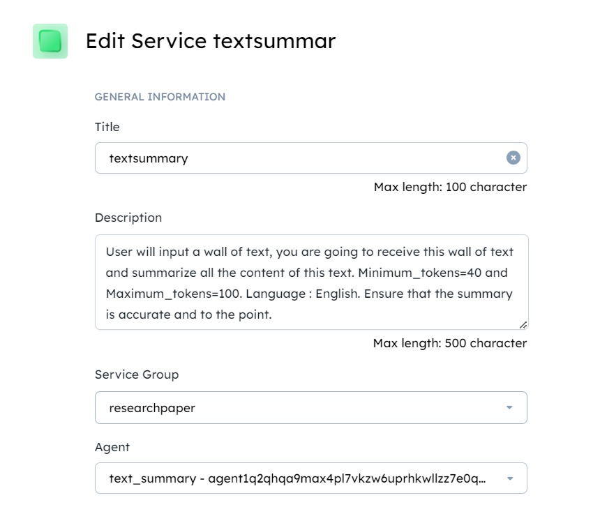  
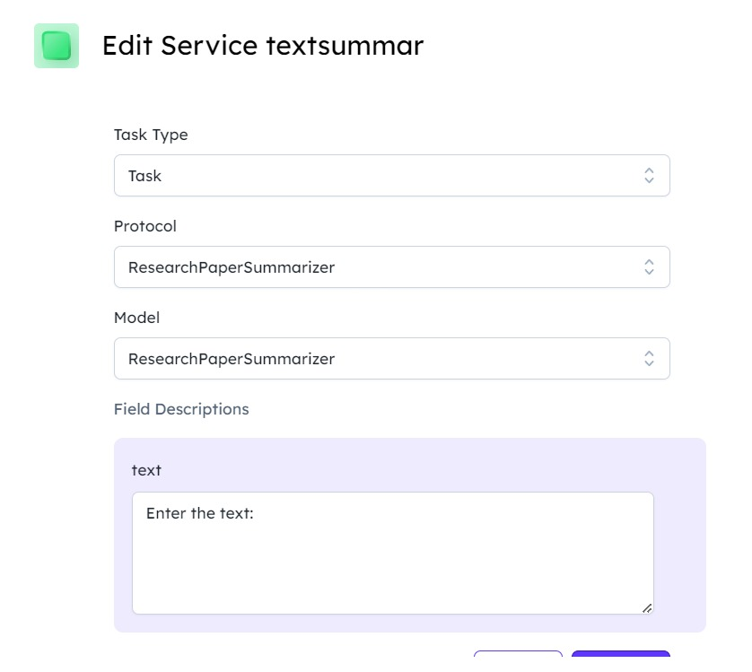 
 
Launch the DeltaV application and change the service to textsummary under the advanced settings
After entering a wall of text the output is as follows:
 
<h3>Test Case 1:</h3> 
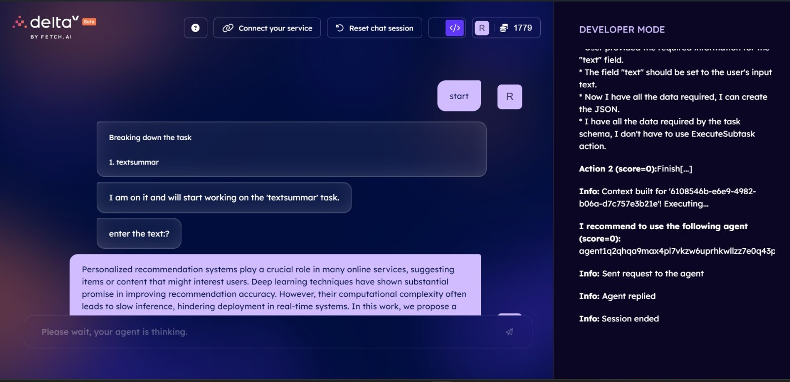 
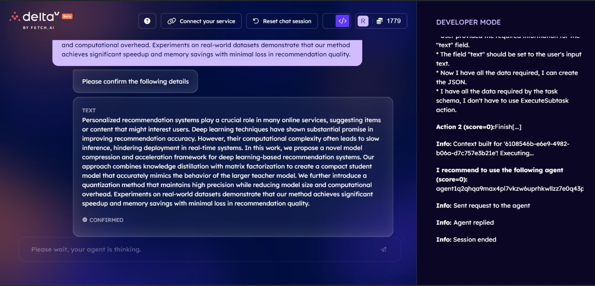 
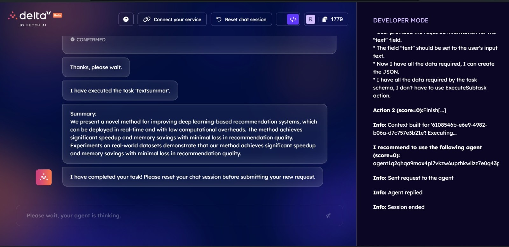 

<h3>Test Case 2:</h3> 
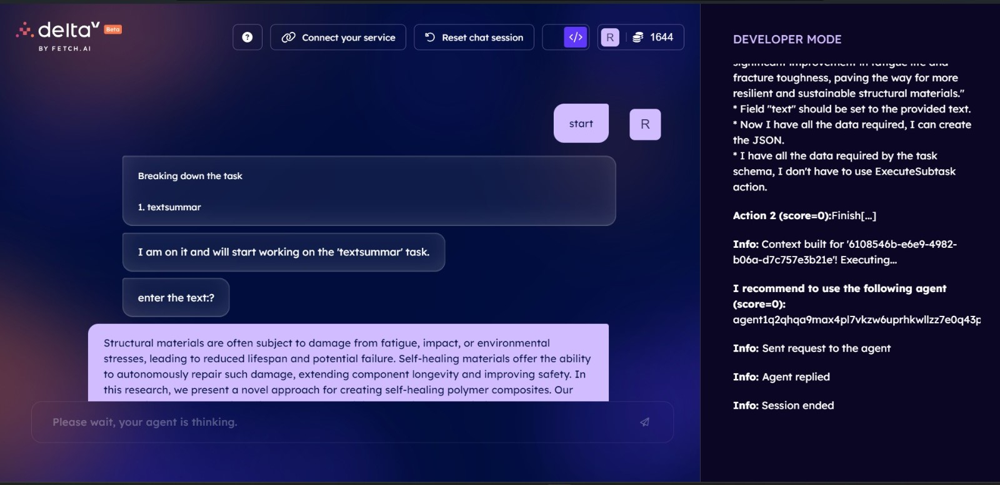 
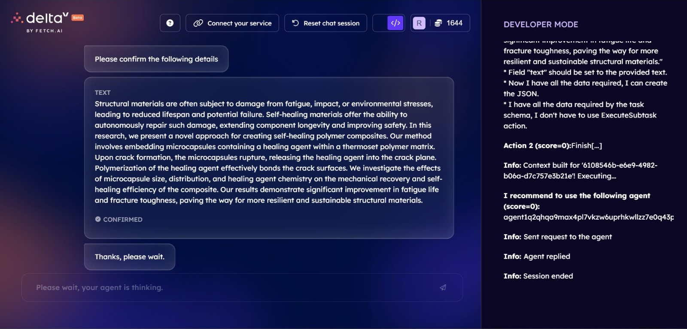 
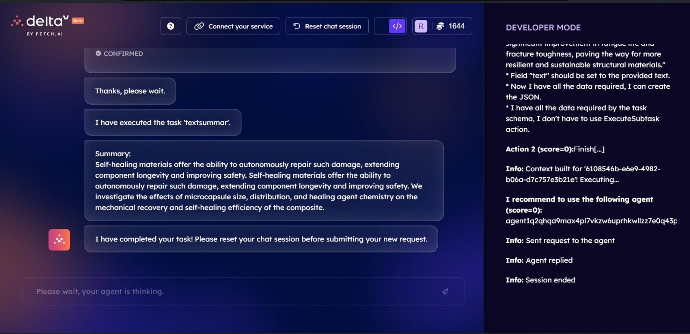 
 
We can however deploy the service on a local machine and make the agents communicate with each other. Here's how to proceed with it.
 
1. Clone the repository:
git clone https://github.com/your_username/DOCRead.git

2. Install the required dependencies:
pip install -r requirements.txt

3. Run the application:
Make sure to add your Hugging Face Token in the str.py file and the run the following command in the terminal:
 "streamlit run str.py"

4. **Usage**:
 - Navigate to the home page.
 - Upload a PDF file using the "Upload File" option.
 - View the extracted text and summary on the "Results" page.
 - Use the chatbot feature to ask questions about the document content.
Below are some picture's from our web application:
 
 
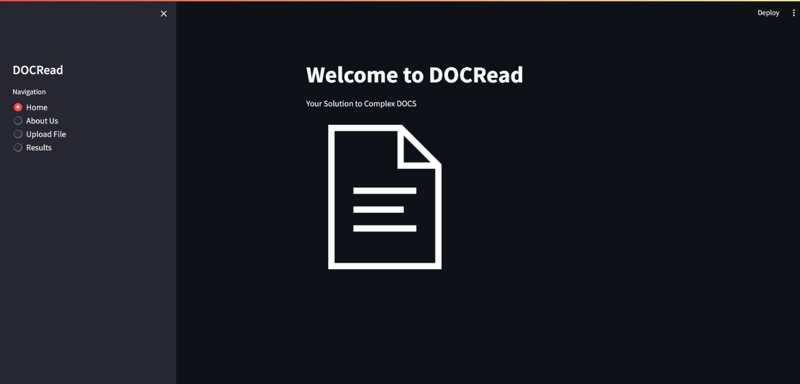 
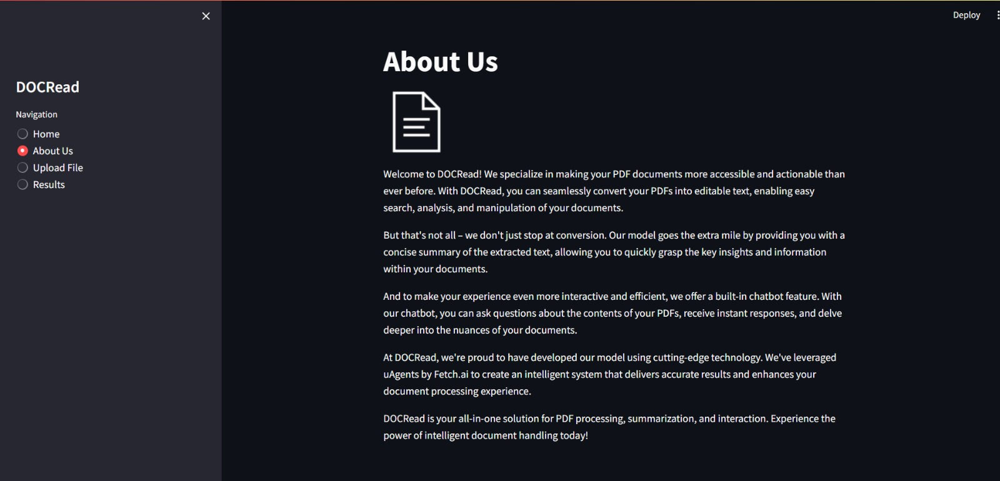 
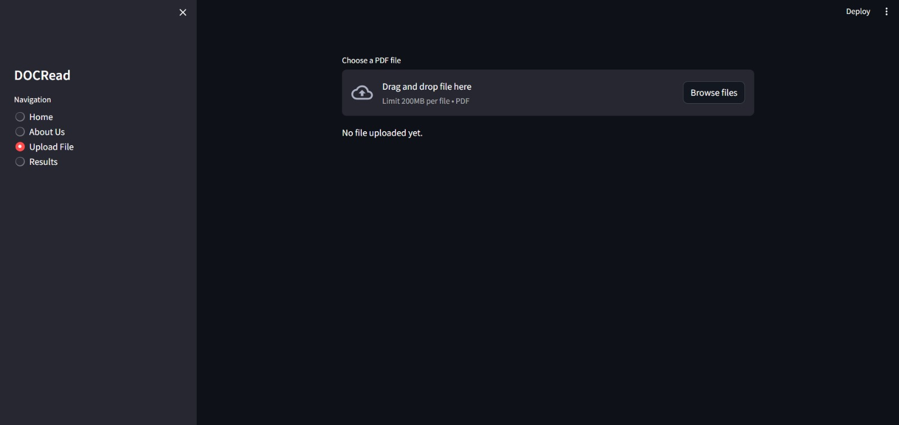 
 

<h3>Test Case 1:</h3> 
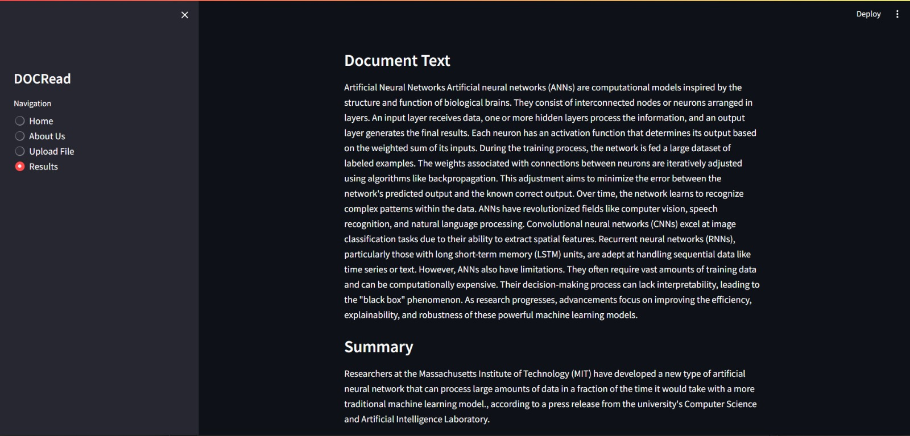 
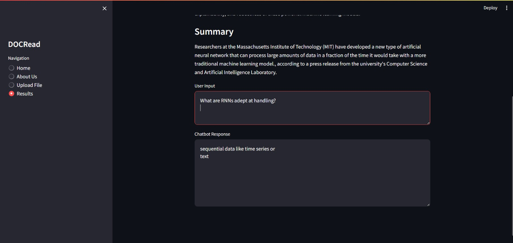 
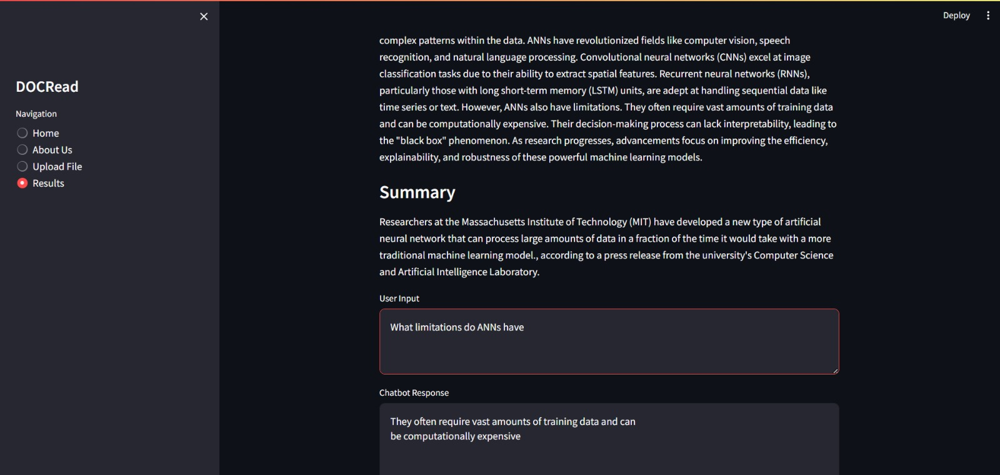 
 
<h3>Test Case 2:</h3> 

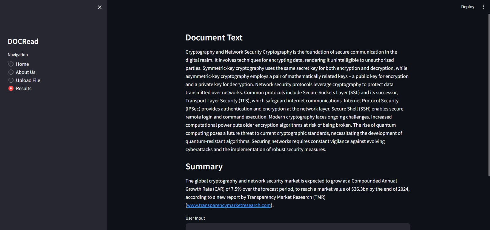 
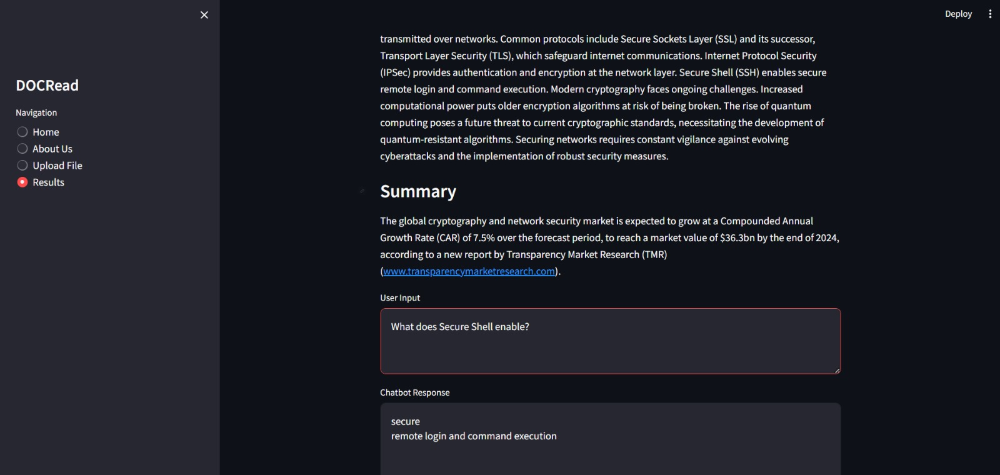 

5. **Acknowledgements**: 
- This project was built using Streamlit, a Python library for creating web applications.
- The PDF extraction functionality is powered by the pdfplumber library.
- The summurization feature was implemented using Google's Pegasus-XSUM model
- The chatbot feature was implemented using roberta-base-squad2
- We'd like to thank Fetch.ai for providing the uAgents framework used in developing our model.

6. **Authors**: 
   #### Team Technix:
   - Rohit Bhandari
   - Jimil Mandani
   - Deepak Borana
