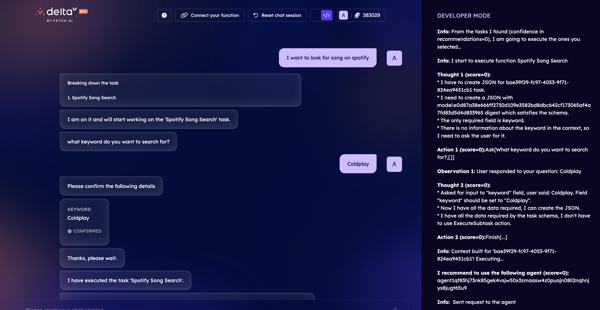
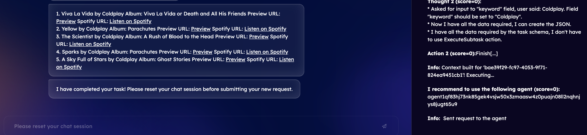

# UAgent Spotify Integration

## Overview
This integration allows users to search for songs on Spotify using keywords. It leverages the Spotify API to fetch song details. The integration is designed to run as an local uAgent on the Agentverse platform and can be interacted using deltaV, providing seamless song search functionality through a conversational interface.

## Steps to Use This Integration on DeltaV

### 1. Set Up the Environment

1. **Clone the repository:**
   ```bash
   git clone https://github.com/fetchai/uAgents.git
   cd uAgents/integrations/spotify-integration
   ```

2. **Create and activate a virtual environment:**

    ```bash
    poetry env use python3
    poetry shell
    ```

3. **Install Dependencies**

    ```bash
    poetry install
    ```

4. **Export the Spotify API credentials:**

    - On Windows:
    ```bash
    set SPOTIPY_CLIENT_ID=your_spotify_client_id
    set SPOTIPY_CLIENT_SECRET=your_spotify_client_secret
    ```

    - On MacOS:
    ```bash
    export SPOTIPY_CLIENT_ID=your_spotify_client_id
    export SPOTIPY_CLIENT_SECRET=your_spotify_client_secret
    ```

Spotify Client_id and Client_secret can be obtained from [Spotify for Developer ↗️](https://developer.spotify.com/dashboard). Change the `ID` and `Secret` in above code to setup the environment variables

### 2. Run the Script

Execute the script to get the agent's address and create a mailbox:

    ```bash
    python3 song_agent.py
    ```

Get the agent mailbox key from [Local Agent ↗️](https://agentverse.ai/agents/local) and for more reference please visit [Mailbox Guide ↗️](https://fetch.ai/docs/guides/agents/intermediate/mailbox#agent-mailboxes)

### 3. Set Up the Function in AgentVerse

Follow the instructions in function.json to configure the service within AgentVerse.

### 4. Query the Song Search Service on DeltaV

Use DeltaV to interact with the agent and request song searches.

## Expected Output

**Song Search Results:** The agent provides a list of songs matching the keyword, including details like song name, artists, album, preview URL, and a link to listen on Spotify.



