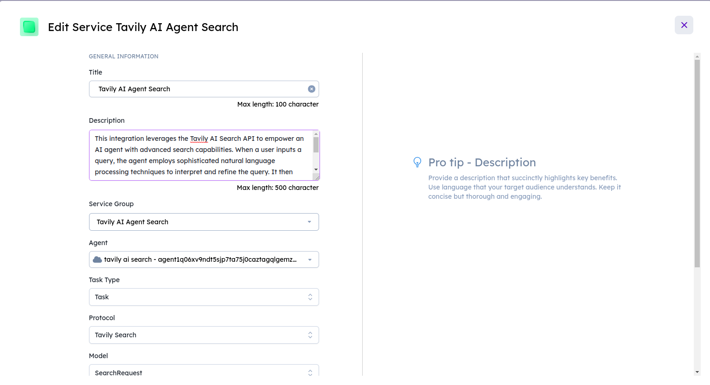

# Tavily AI Agent Search Integration

## Overview
The Tavily AI Agent Search integration enhances the capabilities of an AI agent by leveraging the Tavily AI Search API. This integration allows the AI agent to perform advanced searches, providing users with relevant information based on their queries.

## Tavily Search
**Tavily Search** is a powerful AI-driven search API that enables intelligent content retrieval. It offers features such as configurable search depth, image inclusion/exclusion, and the ability to obtain raw content. The API is designed to enhance search experiences for applications and services.

## Usage
To use the Tavily AI Agent Search integration, create an instance of the `SearchRequest` model with a specific query and send it to the agent. The agent will utilize the Tavily Search API to perform the search and respond with formatted results.

# Getting Tavily API Key

To access the Tavily AI Search API, you need an API key. Follow these steps to obtain your API key:

1. Visit the Tavily website at [https://www.tavily.com](https://www.tavily.com).
2. Sign up or log in to your account.
3. Navigate to the API section.
4. Create a new API key.
5. Copy the generated API key.
6. Replace the placeholder in the script with your actual API key.

Ensure that you keep your API key secure and do not share it publicly. It is a sensitive credential that grants access to Tavily's services.

# Agent Secrets on Agentverse

1. Go to the Agentverse platform.
2. Navigate to the Agent Secrets section.
3. Create an agent and copy the code in it
4. Add a new secret with the key `API_KEY` and the value as your API KEY.

# Steps to Enroll an Agent as a Service on Agentverse

You can integrate into DeltaV your Agents created on your local computer, IoT devices, in the VMs, or agents created on Agentverse. The steps are the same.

Once your agents are run, the agent protocol manifests are uploaded to the Almanac contract in the form of protocol digests. After uploading the manifests, we take the agent addresses and enroll the agents as a service under the "Services" tab in Agentverse.

## Agent Validation on Agentverse Explorer
*Note: You can validate the procedure by searching for your agent's address on Agent Explorer, checking if the protocols have been uploaded successfully. If not, you need to wait for some time (1-2 minutes) until the protocols are uploaded successfully.*

## Create a Service Group

1. Start by creating a new service group on Agentverse.
2. Set up the service group as PRIVATE (you will only be able to see your own agents).
   - If you set up your service group as Public, anyone will be able to see your agents.

**Service group has been created.**

## Create a Service

1. To register the agents as a service, input a concise title and description for the agent service.
2. Choose the service group for the agent service that you've created previously.
3. Fill in the agent address in the Agent field.
4. Set the task type to Task.

Now, your agents are enrolled as a service in Agentverse. You can manage and monitor them under the "Services" tab. Ensure that you follow the agent validation steps on Agent Explorer to confirm successful enrollment.