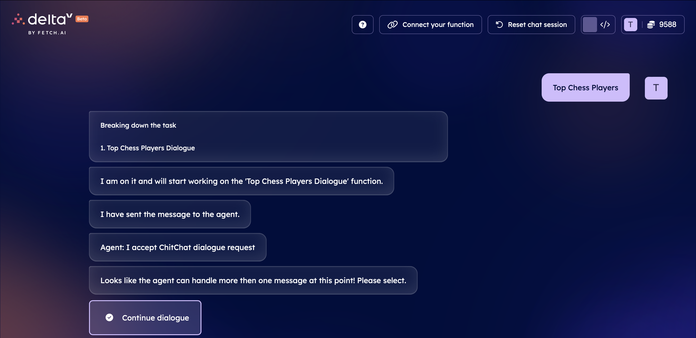
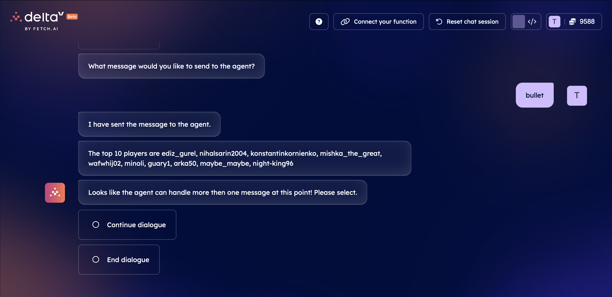

# uAgents Top Chess Players Integration

## Overview
This integration allows users to search for top chess players on Lichess.com based on different gamemodes. It leverages the Lichess.com API to fetch player details. The integration is designed to run as an hosted uAgent on the Agentverse platform and can be interacted using deltaV, providing seamless song search functionality through a conversational interface. The agent has utilized the Chitchat Dialogue schema to allow the user to ask multiple rankings consecutively on DeltaV.

API Documentation: `https://lichess.org/api`

## Steps to use this integration on DeltaV
### This integration is already published and is available on DeltaV. The steps below outline the process of deploying a new agent function for DeltaV.

1. Navigate to `https://agentverse.ai/agents` and log in.
2. Click on the `+ New Agent` button -> Choose `Skeleton Agent` -> Click on the `Create` button.
3. Copy the contents of `agent.py` in this repository and paste these contents in the `agent.py` file in the code editor on `Agentverse`.
4. Click on `Start` on the top-right just above the code editor.
5. To host this agent as a `Function` for discovery on `DeltaV`, click on `Deploy` and click on `+ New Function`.
6. Enter the `Function` details:
- Enter a suitable name for the function, we used the name: `Top Chess Players Dialogue`.
- Enter a suitable description for the function, we used the description: `This Function helps user to check the top 10 players for more than one perfType.`
7. The other details should be left as their default value(s). 
8. Click on the `Create Function` button.
9. After the `Function` has been created, you can test the function on `DeltaV`, this can be done by going the link: `https://deltav.agentverse.ai` or by clicking on the `Test in deltav` button in the `Agentverse` UI.
10. Once satisfied with the results, we can publish the function. Click on the `Publish` button, read and accept the `Terms and Conditions` and click on `OK`.

## Expected Output
Results: The agent provides a list of top 10 player usernames for the gamemode entered by the user.

## Future Work
- Currently only the top 10 players are returned, allowing users to input the number of users they want to see would a good next step.
- Implementing agents for all the `Lichess.com` APIs and creating them as `Secondary Functions` would a good next step to allow the user to interact with the APIs completely.
