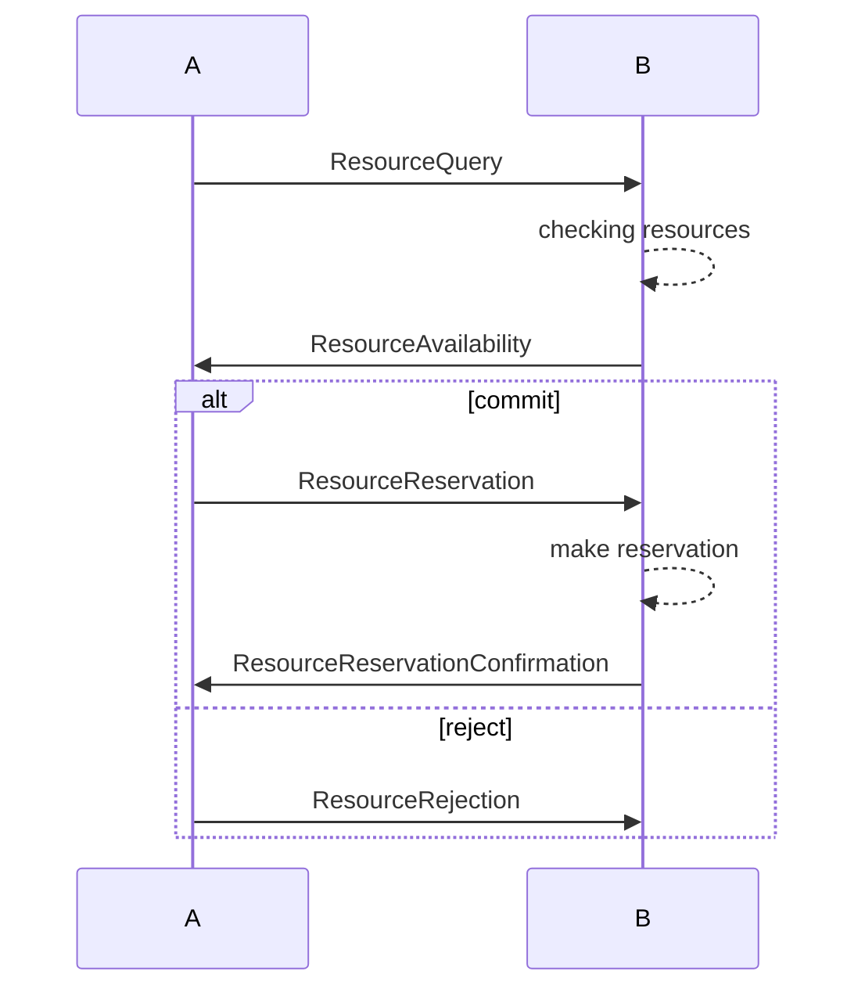

# Example state

# Protocol like implementation
How would an implementation with the current tools look like?
We need a Model for each message and an interaction for each message exchange.
We can not (or only in a limited capacity) define rules or states/state changes or would have to handle those within single handlers.

## Resource Request example
Specific logic needed, 5-9 messages and at least the same amount of interactions necessary.
### Models
- resource request
- resource availability response
- reject resource
- commit to resource
- (request payment)
- (prove payment)
- resource delivery

- generic answer / status message

---

# Required artifacts
- session handling
- ruleset (which message is a viable response to which)
- session + message storage

# Current limitations
- a separate dialogue class would use the uagents inherent Model and message handling but the state logic would be internal to the dialogue class
- if we were to add stateful communication to uagents we would need to potentially change the message and protocol behaviour

- every registered handler will always trigger if the defined message is incoming because there is no state check at the moment
-> workaround could be one handler with internal state + session handling

# Starting point
- 1 agent is reacting to n other agents, sometimes simultaneously
- to keep track of and be able to resume different dialogues (interactions with more than two messages) we would need to generate a session ID and share that with the two communication partners
- we would need to send over the session ID in addition to the content each time a message of a specific dialogue is sent

-> This would mean that we either:
- create a wrapper for dialogue messages where we implicitly sent over additional information each time a message is transferred, or
- bake the session ID in as a parameter in every normal message (which would be None if no dialogue is used)

# Findings
- session id was not generated in local communication: `context.py:417` -> `self._session or uuid.uuid4()`