# A2A uAgent Adapter

A comprehensive Python module for integrating A2A (Agent-to-Agent) systems with uAgents, enabling intelligent multi-agent coordination and communication.

## Overview

The A2A uAgent Adapter provides a seamless bridge between A2A agents and the uAgent ecosystem, allowing for:

- **Agent Coordination**: Manage multiple and single specialized a2a agents from a single interface
- **Intelligent Routing**: Automatically route queries to the most suitable agent based on keywords, specialties, or LLM-based analysis
- **Health Monitoring**: Continuous health checking and discovery of available agents
- **Fallback Mechanisms**: Robust error handling with fallback executors
- **Chat Protocol Integration**: Full support for uAgent chat protocols and messaging

## Features

### Agent Management

- Configure and manage multiple A2A agents with different specialties
- Automatic agent discovery and registration
- Health monitoring and status trackingKey 
- Registers Agent Cards for multiple A2A servers and runs them alongside the uAgent in a single terminal using different ports.
- Supports communication with both single and multiple A2A servers.
- Dynamically determines the appropriate A2A server based on the user query, sends the request via HTTP, and returns the response back to ASI:One.

### Intelligent Routing

- **Keyword Matching**: Route queries based on agent keywords and specialties
- **LLM-Based Routing**: Use AI to intelligently select the best agent for complex queries
- **Round-Robin**: Distribute load evenly across available agents
- **Priority-Based**: Assign priorities to agents for preferential routing

### Communication Protocols

- Full uAgent chat protocol support
- Asynchronous message handling
- Acknowledgment and error handling
- Real-time agent communication

### Reliability Features

- Health checking and agent discovery
- Fallback executor support
- Graceful error handling
- Timeout management

## Installation

```shell
pip install "uagents-adapter[a2a]"
pip install "a2a-sdk[all]"
```

## Quick Start

### Single Agent Setup

```python
from uagents_adapter import SingleA2AAdapter
from your_agent_executor import YourAgentExecutor  # Replace with your executor

def main():
    # Initialize your agent executor
    executor = YourAgentExecutor()

    # Create and run the adapter
    adapter = SingleA2AAdapter(
        agent_executor=executor,
        name="MyAgent",
        description="A helpful AI assistant",
        port=8000,
        a2a_port=9999
    )
    adapter.run()
```

### Multi-Agent Setup

```python
from uagents_adapter import MultiA2AAdapter, A2AAgentConfig

# Configure multiple agents
agent_configs = [
    A2AAgentConfig(
        name="CodeAgent",
        description="Specialized in coding tasks",
        url="http://localhost:9001",
        port=9001,
        specialties=["Python", "JavaScript", "Code Review"],
        priority=2
    ),
    A2AAgentConfig(
        name="DataAgent",
        description="Expert in data analysis",
        url="http://localhost:9002",
        port=9002,
        specialties=["Data Analysis", "Statistics", "Visualization"]
    )
]

# Create multi-agent adapter
adapter = MultiA2AAdapter(
    name="MultiAgentSystem",
    description="Coordinated AI agent system",
    asi_api_key='your_asi_api_key',
    port=8000,
    agent_configs=agent_configs,
    routing_strategy="keyword_match"
)
adapter.run()
```

## Configuration

### A2AAgentConfig

Configure individual agents with specialized capabilities:

```python
config = A2AAgentConfig(
    name="SpecializedAgent",
    description="Agent description",
    url="http://localhost:9000",
    port=9000,
    specialties=["Machine Learning", "Data Science"],
    skills=["python", "tensorflow", "pandas"],  # Auto-generated if not provided
    examples=["Help with ML models", "Analyze data"],  # Auto-generated if not provided
    keywords=["ml", "ai", "data"],  # Auto-generated if not provided
    priority=1  # Higher numbers = higher priority
)
```

### Routing Strategies

#### Keyword Matching (Default)

Routes queries based on keyword and specialty matching with scoring:

```python
adapter = A2AAdapter(
    routing_strategy="keyword_match",
    # ... other config
)
```

#### LLM-Based Routing

Uses AI to intelligently select the best agent:

```python
adapter = A2AAdapter(
    routing_strategy="llm_routing",
    # ... other config
)
```

#### Round Robin

Distributes queries evenly across all healthy agents:

```python
adapter = A2AAdapter(
    routing_strategy="round_robin",
    # ... other config
)
```


### A2AAdapter

Main adapter class for managing A2A agents.

#### Constructor Parameters

| Parameter | Type | Default | Description |
|-----------|------|---------|-------------|
| `name` | str | Required | Name of the adapter |
| `description` | str | Required | Description of the adapter |
| `asi_api_key` | str | Required | ASI:One API Keys |
| `port` | int | 8000 | uAgent port |
| `mailbox` | bool | True | Enable mailbox functionality |
| `seed` | str | None | Seed for uAgent (auto-generated if None) |
| `agent_configs` | List[A2AAgentConfig] | [] | List of agent configurations |
| `fallback_executor` | AgentExecutor | None | Fallback executor for unrouted queries |
| `routing_strategy` | str | "keyword_match" | Routing strategy to use |

#### Methods

##### `add_agent_config(config: A2AAgentConfig)`

Add a new agent configuration to the adapter.

##### `run()`

Start the adapter and begin processing messages.

### A2AAgentConfig

Configuration class for individual A2A agents.

#### Constructor Parameters

| Parameter | Type | Default | Description |
|-----------|------|---------|-------------|
| `name` | str | Required | Agent name |
| `description` | str | Required | Agent description |
| `url` | str | Required | Agent URL |
| `port` | int | Required | Agent port |
| `specialties` | List[str] | Required | Agent specialties |
| `skills` | List[str] | Auto-generated | Agent skills |
| `examples` | List[str] | Auto-generated | Usage examples |
| `keywords` | List[str] | Auto-generated | Routing keywords |
| `priority` | int | 1 | Agent priority (higher = more preferred) |

## Architecture

```mermaid
flowchart LR
    UA[uAgent Chat<br>Protocol]
    AD[A2A Adapter]
    AG[A2A Agents]
    EUA[External<br>uAgents]
    HM[Health<br>Monitor]

    UA <--> AD
    AD <--> AG
    EUA <--> AD
    HM <--> AD

    subgraph Adapter_Router_Discovery [ ]
        direction TB
        RT[Router<br>• Keywords<br>• LLM<br>• Priority]
        DC[Discovery<br>& Health]
    end

    subgraph A2A_Agents [ ]
        direction TB
        Code[Code Agent]
        Data[Data Agent]
        Chat[Chat Agent]
    end

    AD --> RT
    AD --> DC

    AG --> Code
    AG --> Data
    AG --> Chat
```




## Message Flow

1. **Incoming Message**: External uAgent sends chat message
2. **Agent Discovery**: Adapter discovers and health-checks available agents
3. **Query Routing**: Router selects best agent based on strategy
4. **Message Forwarding**: Query sent to selected A2A agent
5. **Response Processing**: Agent response processed and formatted
6. **Reply**: Response sent back to original sender
7. **Acknowledgment**: Confirmation sent to complete the cycle

## Examples

### Single Agent Example

```python
import asyncio
import threading
import time
from typing import Dict, List
from dataclasses import dataclass

from uagents_adapter import SingleA2AAdapter
from brave.agent import BraveSearchAgentExecutor


@dataclass
class AgentConfig:
    name: str
    description: str
    port: int
    a2a_port: int
    specialties: List[str]
    executor_class: str


class SingleAgent:
    def __init__(self):
        self.coordinator: SingleA2AAdapter = None
        self.agent_configs: List[AgentConfig] = []
        self.executors: Dict[str, any] = {}
        self.running = False

    def setup_agents(self):
        print("🔧 Setting up A2A SingleAgent System\n" + "=" * 60)
        self.agent_configs = [
            AgentConfig(
                name="brave_search",
                description="AI Search Agent powered by Brave Search API",
                port=8100,
                a2a_port=10020,
                specialties=["web search", "local search", "information retrieval", "news search", "business lookup"],
                executor_class="BraveSearchAgentExecutor"
            ),
        ]
        self.executors = {"BraveSearchAgentExecutor": BraveSearchAgentExecutor()}
        for config in self.agent_configs:
            print(f"✅ {config.name}: {', '.join(config.specialties)}")

    def start_individual_a2a_servers(self):
        from a2a.server.apps import A2AStarletteApplication
        from a2a.server.request_handlers import DefaultRequestHandler
        from a2a.server.tasks import InMemoryTaskStore
        from a2a.types import AgentCapabilities, AgentCard, AgentSkill
        import uvicorn

        def start_server(config: AgentConfig, executor):
            try:
                skill = AgentSkill(
                    id=f"{config.name.lower()}_skill",
                    name=config.name.replace("_", " ").title(),
                    description=config.description,
                    tags=config.specialties,
                    examples=[f"Search for {s.lower()}" for s in config.specialties[:3]],
                )
                agent_card = AgentCard(
                    name=config.name.replace("_", " ").title(),
                    description=config.description,
                    url=f"http://localhost:{config.a2a_port}/",
                    version="1.0.0",
                    defaultInputModes=["text"],
                    defaultOutputModes=["text"],
                    capabilities=AgentCapabilities(),
                    skills=[skill],
                )
                server = A2AStarletteApplication(
                    agent_card=agent_card,
                    http_handler=DefaultRequestHandler(
                        agent_executor=executor,
                        task_store=InMemoryTaskStore()
                    )
                )
                print(f"🚀 Starting {config.name} on port {config.a2a_port}")
                uvicorn.run(server.build(), host="0.0.0.0", port=config.a2a_port, timeout_keep_alive=10, log_level="info")
            except Exception as e:
                print(f"❌ Error starting {config.name}: {e}")

        print("\n🔄 Starting A2A servers...")
        for config in self.agent_configs:
            executor = self.executors[config.executor_class]
            threading.Thread(target=start_server, args=(config, executor), daemon=True).start()
            time.sleep(1)
        print("⏳ Initializing servers..."), time.sleep(5), print("✅ All A2A servers started!")

    def create_coordinator(self):
        print("\n🤖 Creating Coordinator...")
        self.coordinator = SingleA2AAdapter(
            agent_executor=self.executors["BraveSearchAgentExecutor"],
            name="bravedahuahuah",
            description="Routes queries to Brave Search AI specialists",
            port=8200,
            a2a_port=10030  
        )
        print(f"✅ Coordinator on port {self.coordinator.port}")
        return self.coordinator

    def start_system(self):
        print("🚀 Starting A2A System\n" + "=" * 70)
        try:
            self.setup_agents()
            self.start_individual_a2a_servers()
            coordinator = self.create_coordinator()
            print(f"\n🎯 Running coordinator on port {coordinator.port}...\nPress Ctrl+C to stop\n")
            self.running = True
            coordinator.run()
        except KeyboardInterrupt:
            print("\n👋 System shutdown...")
            self.running = False
        except Exception as e:
            print(f"❌ Error: {e}")
            self.running = False


def create_brave_search_agent_system():
    return SingleAgent()


def main():
    try:
        system = create_brave_search_agent_system()
        system.start_system()
    except KeyboardInterrupt:
        print("\n👋 Shutdown complete!")
    except Exception as e:
        print(f"\n❌ Error: {e}")


if __name__ == "__main__":
    main()
```

### Multi-Agent Example

```python
import asyncio
import threading
import time
from typing import Dict, List
from dataclasses import dataclass
from uagents_adapter import MultiA2AAdapter, A2AAgentConfig
from agents.research_agent import ResearchAgentExecutor
from agents.coding_agent import CodingAgentExecutor
from agents.analysis_agent import AnalysisAgentExecutor

@dataclass
class AIAgentConfig:
    name: str
    description: str
    port: int
    a2a_port: int
    specialties: List[str]
    executor_class: str

class MultiAgentOrchestrator:
    def __init__(self):
        self.coordinator = None
        self.agent_configs: List[AIAgentConfig] = []
        self.executors: Dict[str, any] = {}
        self.running = False

    def setup_agents(self):
        self.agent_configs = [
            AIAgentConfig(
                name="research_specialist",
                description="AI Research Specialist for research and analysis",
                port=8100,
                a2a_port=10020,
                specialties=["research", "analysis", "fact-finding", "summarization"],
                executor_class="ResearchAgentExecutor"
            ),
            AIAgentConfig(
                name="coding_specialist",
                description="AI Software Engineer for coding",
                port=8102,
                a2a_port=10022,
                specialties=["coding", "debugging", "programming"],
                executor_class="CodingAgentExecutor"
            ),
            AIAgentConfig(
                name="analysis_specialist",
                description="AI Data Analyst for insights and metrics",
                port=8103,
                a2a_port=10023,
                specialties=["data analysis", "insights", "forecasting"],
                executor_class="AnalysisAgentExecutor"
            )
        ]
        self.executors = {
            "ResearchAgentExecutor": ResearchAgentExecutor(),
            "CodingAgentExecutor": CodingAgentExecutor(),
            "AnalysisAgentExecutor": AnalysisAgentExecutor()
        }

    def start_individual_a2a_servers(self):
        from a2a.server.apps import A2AStarletteApplication
        from a2a.server.request_handlers import DefaultRequestHandler
        from a2a.server.tasks import InMemoryTaskStore
        from a2a.types import AgentCapabilities, AgentCard, AgentSkill
        import uvicorn

        def start_server(config: AIAgentConfig, executor):
            try:
                skill = AgentSkill(
                    id=f"{config.name}_skill",
                    name=config.name.title(),
                    description=config.description,
                    tags=config.specialties
                )
                agent_card = AgentCard(
                    name=config.name.title(),
                    description=config.description,
                    url=f"http://localhost:{config.a2a_port}/",
                    version="1.0.0",
                    defaultInputModes=["text"],
                    defaultOutputModes=["text"],
                    capabilities=AgentCapabilities(),
                    skills=[skill]
                )
                server = A2AStarletteApplication(
                    agent_card=agent_card,
                    http_handler=DefaultRequestHandler(
                        agent_executor=executor,
                        task_store=InMemoryTaskStore()
                    )
                )
                uvicorn.run(server.build(), host="0.0.0.0", port=config.a2a_port, log_level="info")
            except Exception as e:
                pass

        for config in self.agent_configs:
            thread = threading.Thread(
                target=start_server,
                args=(config, self.executors[config.executor_class]),
                daemon=True
            )
            thread.start()
            time.sleep(1)
        time.sleep(5)

    def create_coordinator(self):
        a2a_configs = [
            A2AAgentConfig(
                name=config.name,
                description=config.description,
                url=f"http://localhost:{config.a2a_port}",
                port=config.a2a_port,
                specialties=config.specialties,
                priority=3 if "research" in config.specialties or "coding" in config.specialties else 2
            ) for config in self.agent_configs
        ]
        self.coordinator = MultiA2AAdapter(
            name="coordinator",
            description="Routes queries to AI specialists",
            asi_api_key='your_asi_api_key',
            port=8200,
            mailbox=True,
            agent_configs=a2a_configs,
            routing_strategy="keyword_match"
        )
        return self.coordinator

    def start_system(self):
        try:
            self.setup_agents()
            self.start_individual_a2a_servers()
            coordinator = self.create_coordinator()
            self.running = True
            coordinator.run()
        except KeyboardInterrupt:
            self.running = False
        except Exception:
            self.running = False

def main():
    try:
        system = MultiAgentOrchestrator()
        system.start_system()
    except KeyboardInterrupt:
        pass
    except Exception:
        pass

if __name__ == "__main__":
    main()
```

## Advanced Usage

### Custom Fallback Executor

```python
class CustomFallbackExecutor(AgentExecutor):
    async def execute(self, context, event_queue):
        # Custom fallback logic
        pass

adapter = A2AAdapter(
    name="SystemWithFallback",
    fallback_executor=CustomFallbackExecutor(),
    # ... other config
)
```

### Dynamic Agent Registration

```python
# Start with basic configuration
adapter = A2AAdapter(name="DynamicSystem")

# Add agents dynamically
new_agent = A2AAgentConfig(
    name="NewAgent",
    url="http://localhost:9003",
    port=9003,
    specialties=["Natural Language Processing"]
)
adapter.add_agent_config(new_agent)
```

### Health Monitoring

The adapter automatically monitors agent health and excludes unhealthy agents from routing:

- Health status is checked on startup and periodically
- Unhealthy agents are automatically excluded from routing
- Health checks include:
  - Agent card availability at /.well-known/agent.json
  - HTTP response status
  - Response time monitoring

## Error Handling

The adapter includes comprehensive error handling:

- **Agent Unavailable**: Automatically routes to alternative agents
- **Network Timeouts**: Configurable timeout settings with graceful degradation
- **Invalid Responses**: Fallback to error messages or alternative agents
- **Health Check Failures**: Automatic agent exclusion and retry logic


